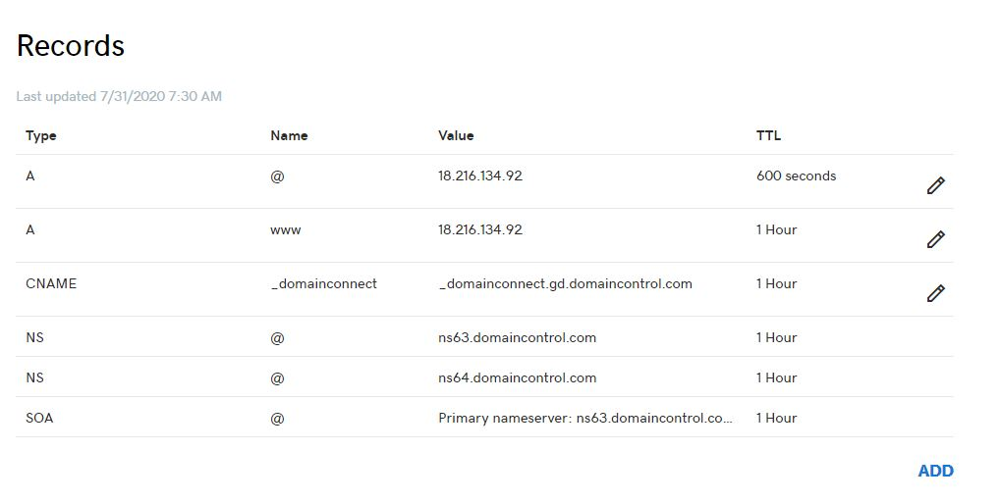
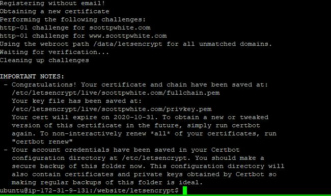
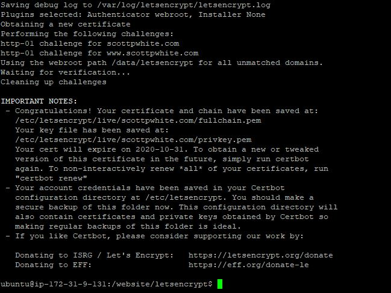
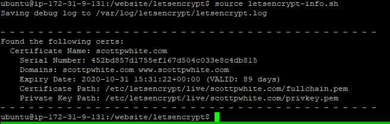
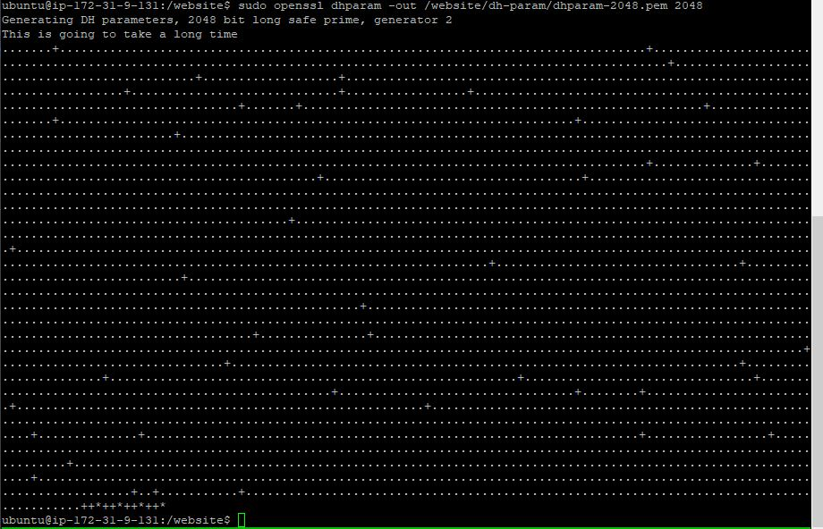

# Website

Personal website to display some data products and to impose my will on the internet via blog. 

Note: This repo works for the `scottpwhite.com` domain and is hard-coded in every `.conf` and `.sh` file. If adopting 
this repo to a new website, you will need to change these along with my email in `letsencrypt-prod.sh`.

---

---

###  Create Instance and Download Files

- Set Up AWS EC2 instance: 
    - Ubuntu 18.04 Image
    - t2.small (~$0.0023 / hour or ~$16 / month)
        - Can't install project on t2.micro (Exits with `Killed` error)
    - Spot Requests (Will lower the costs but not sure how much)
    - Explicitly select a subnetwork (probably unnecessary)
    - Enable Auto-assign Public IP
    - 16 GB EBS (Costs ~$0.10 GB / month, @TODO trim down)
    - Security Group `Website`:
        - SSH on 22
        - HTTP on 80
        - HTTPS on 443
        - Custom TCP on 5000 (for backend)
    
- Set up project
    - SSH into instance
    - Go to server root (on EC2; `cd ../../` when default connection places you in `home/ubuntu`)
    - `sudo git clone https://github.com/spwhite1337/website.git`
    - `cd website`
    - `source initialization.sh`
        - Get AWS Keys from S3 Bucket `s3://scott-p-white`
        
### GoDaddy    

- Update DNS records in GoDaddy account
    - Log-in -> Scott White (upper right) -> Manage Domains -> DNS -> Manage Zones -> Search `scottpwhite.com`
    - Match records to the IP Address from the EC2 instance
    
        
    
    - Can take a little as minutes to work, but takes days to cover the globe.
    
### Serve over HTTP

- Serve Website over HTTP
    - `cd website/frontend`
    - `echo "VUE_APP_ROOT_API=http://scottpwhite.com" > .env.production`
    - `sudo docker-compose -f docker-compose-http.yml up --build`

---

### Add SSL Certification

SSL Certification can be accomplished with a free process from [Let's Encrypt](https://letsencrypt.org/) to enable 
transfer of data over HTTPS and removal of that annoying and embarrassing warning that chrome puts on sites without SSL 
certification. 

First, generate an SSL certificate with Let's Encrypt / Certbot on a test site served over the domain 
[Reference](https://www.humankode.com/ssl/how-to-set-up-free-ssl-certificates-from-lets-encrypt-using-docker-and-nginx).
- Stop and prune any running containers (e.g. `sudo docker system prune -a`)
- `cd letsencrypt`
- `sudo docker-compose up -d`
- Go to `http://scottpwhite.com` and `http://www.scottpwhite.com` to verify site is working over http
- In another session, test the certification process with:
    - `source letsencrypt-staging.sh`
    - You should see something like:
    
        
    
    - Ensure success with `source letsencrypt-info.sh`    
    - You should see something like the following:
        
        

- Generate the certificates and save them to docker-volumes (rate limits are currently at 50 certificates per domain 
per week. Should be plenty but best not waste them.):
    - Remove staging volumes: `sudo rm -rf ../../docker-volumes/`
    - Get certs with `source letsencrypt-prod.sh`
    
        
    
    - See info with `source letsencrypt-info.sh`
    
        

- Shut down initial certification container with: `sudo docker-compose down`

### Add DH-params

This is a security key I don't totally understand but was recommended by the internet. We'll add it as well.

- `cd website && mkdir dh-param`
- `sudo openssl dhparam -out /website/dh-param/dhparam-2048.pem 2048`
- Should output:

    

### Serve Over HTTPS

- Clear all containers / networks with: `sudo docker system prune -a`
- Set `VUE_APP_ROOT_API=https://scottpwhite.com`
- `cd website/frontend`
- `echo "VUE_APP_ROOT_API=https://scottpwhite.com" > .env.production`
- `sudo docker-compose -f docker-compose-https.yml up --build`

### Automate SSL Renewal

Second, set up a process to automatically renew SSL certificates in the docker environment:
- `cd website/letsencrypt`
- `crontab cron_renewal.txt`
