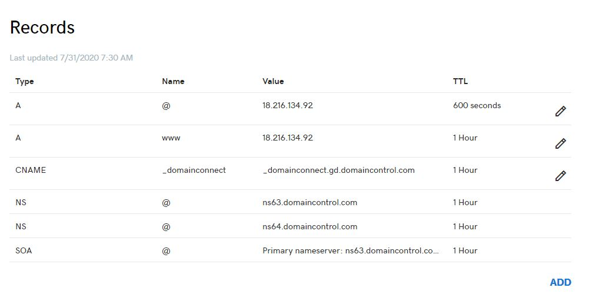
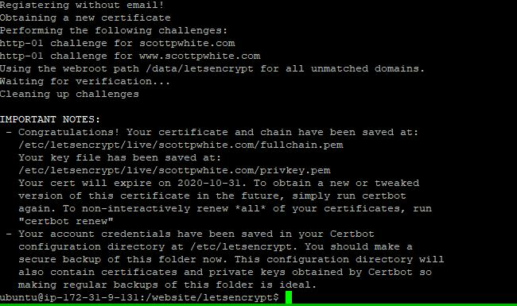
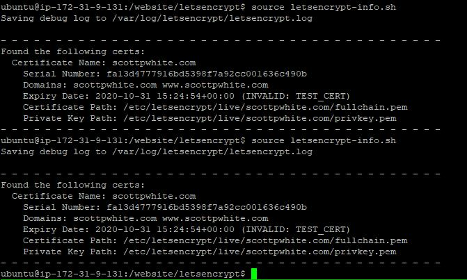
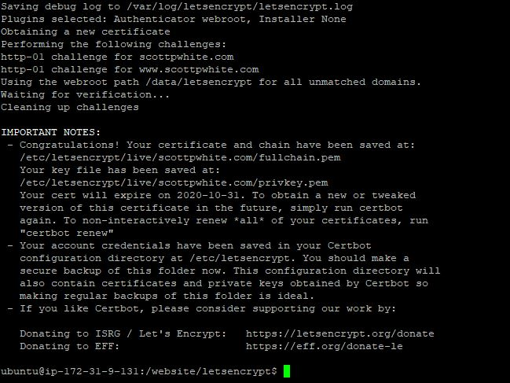
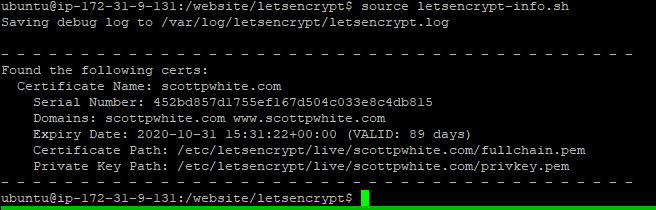

# Website

Personal website to display some data products and to impose my will on the internet via blog. 

---

---

## Development

Run two independent apps that do not communicate with each other for debugging and dev. Requires: Python 3.5 and npm.

- `cd backend`
- `set FLASK_APP=run.py` (`export FLASK_APP=run.py`)
- `pip install -e .`
- `flask run`
- `cd frontend`
- `npm install`
- `npm run serve`

The full app can be run through docker but tends to slow down my computer a lot.
- `cd website`
- `echo "VUE_APP_ROOT_API=http://localhost > frontend/.env.production`
- `docker-compose -f docker-compose-http.yml up --build`

## Server

### 1.) Create Instance and Download Files

- Set Up AWS EC2 instance: 
    - Ubuntu 18.04 Image
    - t2.small (~$0.0023 / hour or ~$16 / month)
        - t2.micro works if you download the `minified` branch of `card-classifier`, otherwise you will get a 
        `Killed` error during install of `master` on t2.micro (I assume `tensorflow` is the culprit). This is ~1/2 the 
        price of t2.small.
    - Optional: Check Spot Requests to lower costs. But be warned that Amazon is on bullshit and your instance will 
    disappear without explanation.
    - Enable Auto-assign Public IP
    - 10-12 GB EBS (Costs ~$0.10 GB / month)
    - Security Group `Website`:
        - SSH on 22
        - HTTP on 80
        - HTTPS on 443
    
- Set up project
    - SSH into instance
    - Go to server root (EC2 defaults login as `ubuntu` so just `cd ../../` after ssh-ing in)
    - `sudo git clone https://github.com/spwhite1337/website.git`
    - `cd website`
    - `source initialization.sh`
        - Get AWS Keys from S3 Bucket `s3://scott-p-white/personal/keys`
        
### 2.) GoDaddy    

- Update DNS records in GoDaddy account
    - Log-in -> Scott White (upper right) -> Manage Domains -> DNS -> Manage Zones -> Search `scottpwhite.com`
    - Match records to the IP Address from the EC2 instance
    
        
    
    - Can take as little as minutes to work, but takes days to cover the globe.
    
- Update hard-coded domain name in the `nginx` folder and `letsencrypt` folder of this repo. The rest of the docs assume
`scottpwhite.com`.
    - `nginx.conf`
    - `letsencrypt-staging.sh`
    - `letsencrypt-prod.sh` (Also change the email in this script)
    
---

### 3a.) Serve over HTTP

- `cd website`
- `sudo sh -c "echo 'VUE_APP_ROOT_API=http://scottpwhite.com' > frontend/.env.production"`
- `sudo docker-compose -f docker-compose-http.yml up --build`

---

### 3b.) Add SSL Certification

SSL Certification can be accomplished with a free process from [Let's Encrypt](https://letsencrypt.org/) to enable 
transfer of data over HTTPS.

Generate an SSL certificate with Let's Encrypt / Certbot on a test site served over the domain. 
([Reference](https://www.humankode.com/ssl/how-to-set-up-free-ssl-certificates-from-lets-encrypt-using-docker-and-nginx))
- Stop and prune any running containers (e.g. `sudo docker system prune -a`)
- `cd website/letsencrypt`
- `sudo docker-compose up -d`
- Go to `http://scottpwhite.com` and `http://www.scottpwhite.com` to verify site is working over http
- Test the certification process with:
    - `source letsencrypt-staging.sh`
    
        
    
    - Optional: Ensure success with `source letsencrypt-info.sh`    
        
        

- Generate the certificates and save them to docker-volumes (rate limits are currently at 50 certificates per domain 
per week. Should be plenty but best not waste them.):
    - Remove staging volumes: `sudo rm -rf ../../docker-volumes/`
    - Get certs with `source letsencrypt-prod.sh`
    
        
    
    - Optional: See info with `source letsencrypt-info.sh`
    
        

- Shut down initial certification container with: `sudo docker-compose down`

### 4.) Add DH-params

This is a security key I don't totally understand but was recommended by the internet. We'll add it as well.

- `cd website`
- `sudo mkdir dh-param`
- `sudo openssl dhparam -out /website/dh-param/dhparam-2048.pem 2048`

    

### 5.) Serve Over HTTPS

- Clear all containers / networks with: `sudo docker system prune -a`
- `cd website`
- `sudo sh -c "echo 'VUE_APP_ROOT_API=https://scottpwhite.com' > frontend/.env.production"`
- `sudo docker-compose -f docker-compose-https.yml up --build`

### 6.) Automate SSL Renewal

Set up a cron job to automatically renew SSL certificates in the docker environment (This still needs to be verified):
- `0 0 1 * * cd website/letsencrypt && echo 'Y' | source cert_renewal.sh >> cron.txt`
